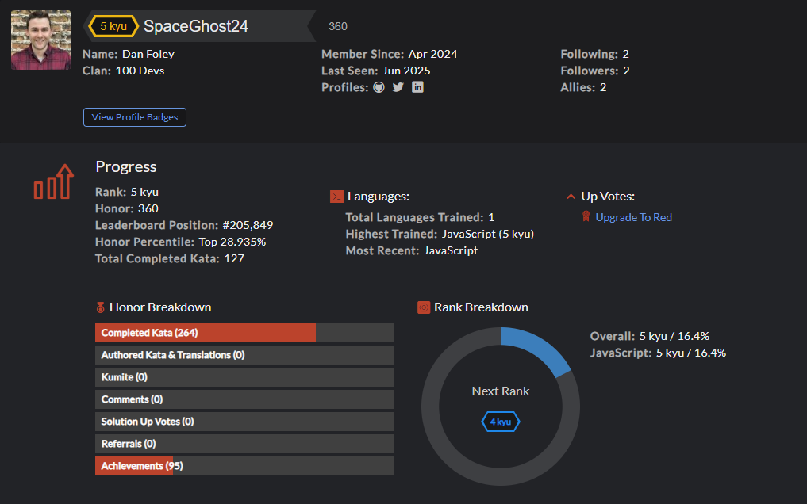

# CodeWars Challenges: [Visit Here](https://www.codewars.com/users/SpaceGhost24)

A repository filled with codewars challenges (kata). Pushing 5 solutions every week.

## How It's Made:

**Tech used:** 

To stay sharp, I make it a habit to complete one familiar and one new coding Kata each weekday.

## Optimizations

I regularly improve my code through refactoring, focusing either on enhancing efficiency or making it more readable.

## Lessons Learned:

I've learned that while many problems have multiple valid solutions, a correct answer isn't always the most efficient or elegant. Writing better code often means going beyond correctness to find the most effective approach.
